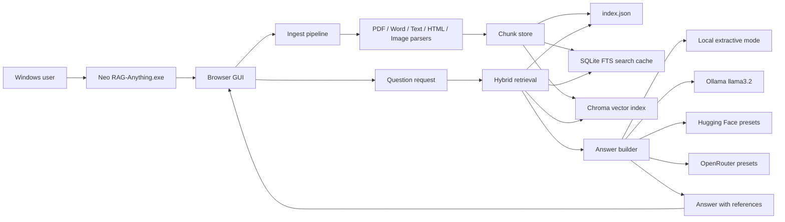

# Neo RAG-Anything + Features

Neo RAG-Anything is a Windows desktop package for local document retrieval
and grounded question answering. It lets you upload documents, build a local
search index, retrieve the most relevant chunks, and generate answers using
local extraction, Ollama, Hugging Face, or OpenRouter.

The application is distributed as a password-protected Windows ZIP only. Source
code and build instructions are not distributed from this repository.

## Download

Download the Windows package from the release page:

https://github.com/diazneoones82/Neo-Rag-Anything-Features/releases/tag/v1.0.0

Package:

```text
Neo-RAG-Anything-Windows.zip
```

The ZIP is password protected. DM the owner for access.

ZIP comment:

```text
DM to owner
```

## What It Does

Neo RAG-Anything helps you work with large document collections on a Windows
machine. You can ingest PDFs, Word documents, text, Markdown, HTML pages, and
common image files, then ask questions across the indexed content.

Core capabilities:

- Local document ingest and chunking
- Hybrid search across lexical, phrase-aware semantic, and vector indexes
- Optional ChromaDB vector retrieval
- Local extractive answers without an API token
- Optional model-written answers through Ollama, Hugging Face, or OpenRouter
- Optional public web result append for cross-checking
- Export/import of ingest data for moving indexes between machines

## Product Architecture



## How To Use The Windows ZIP

1. Download `Neo-RAG-Anything-Windows.zip` from the release page.
2. Extract it with the password provided by the owner.
3. Open the extracted folder.
4. Run:

```text
Neo RAG-Anything.exe
```

5. Click **Start** in the launcher.
6. Click **Open GUI** if the browser does not open automatically.
7. Use the browser UI at:

```text
http://127.0.0.1:7860
```

## Basic Workflow

1. Set a storage folder if you want the index stored outside the default app
   data location.
2. Upload documents with **Choose Files**, **Choose Folder**, or drag and drop.
3. Wait for ingest to finish.
4. Ask a question in the query box.
5. Review the answer and the **References used** section.

The app stores local settings and indexes on your Windows machine. API tokens
are not included in the package and must be entered by the user in the GUI.

## Response Engines

### Local Extractive

Uses retrieved chunks only. No model API token is required.

### Ollama

Uses a locally installed Ollama model. The default model field is:

```text
llama3.2
```

### Hugging Face

Uses a saved Hugging Face token and the available preset list in the GUI.

### OpenRouter

The default OpenRouter model is:

```text
poolside/laguna-m.1-20260312:free
```

Available OpenRouter presets include:

- `poolside/laguna-m.1-20260312:free`
- `openrouter/free`
- `openai/gpt-oss-20b:free`
- `nvidia/nemotron-nano-9b-v2:free`
- `liquid/lfm-2.5-1.2b-instruct-20260120:free`
- `z-ai/glm-4.5-air:free`

When `openrouter/free` is selected, the app tries only this sequence:

1. `openai/gpt-oss-20b:free`
2. `liquid/lfm-2.5-1.2b-instruct-20260120:free`
3. `nvidia/nemotron-nano-9b-v2:free`
4. `nvidia/nemotron-nano-9b-v2:free`
5. `z-ai/glm-4.5-air:free`

## License

Neo RAG-Anything is proprietary, use-only software. You may run the provided
Windows package, but you may not copy, modify, redistribute, reverse engineer,
recreate, rebuild, repackage, or use the code or assets to produce another
application without a separate written agreement from the owner.
